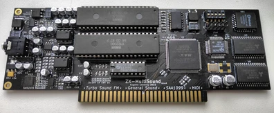
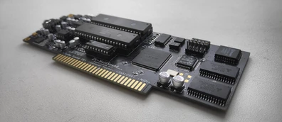

## ZX-MultiSound
Sound card for ZX Spectrum (NemoBus).

### Tech specs
* TurboSound FM (2xYM2203)
* General Sound (16MHz, 1024Kb of RAM)
* SAA1099 (use port #FF/#1FF to access SAA chip, write #F7/#FF to #FFFD port to enable/disable SAA)
* SounDrive (ports #0F, #1F, #4F, #5F)
* MIDI synthesizer (controlled via YM(AY) chip - compatible with ZX Spectrum 128K / ZXUNO)
* Low profile PCB: 170x64mm
* 5V and 12V power required
* 4x 1-bit digital DACs for GS and SounDrive

### Changelog & current status
* Rev.A - first release. Please note the [errata](pcb/rev.A/ERRATA.txt);
* Rev.A1 - fixed known rev.A issues. Please note the [errata](pcb/rev.A1/ERRATA.txt).

Sound card has been tested only with ZX Evolution. You can use it with another computer at your own risk.

### Related projects
* Turbo Sound FM - [link](http://www.nedopc.com/TURBOSOUND/ts-fm.php)
* ZXM-SoundCard - [link](http://micklab.ru/My%20Soundcard/ZXMSoundCard.htm)
* ZXM-GeneralSound - [link](http://micklab.ru/My%20Soundcard/ZXMGeneralSound.htm)
* NeoGS - [link](http://www.nedopc.com/gs/ngs.php)
